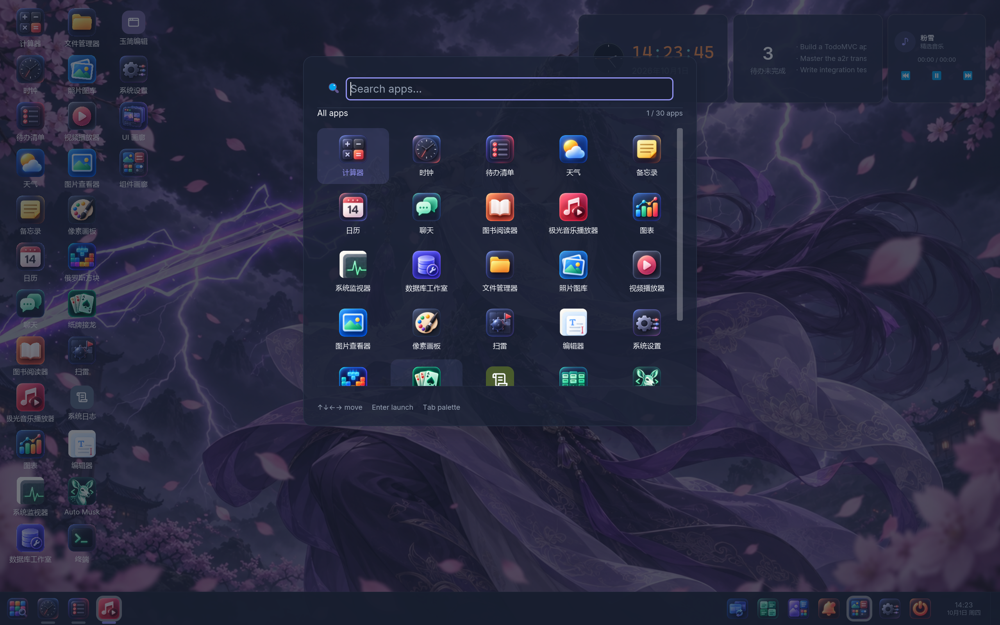
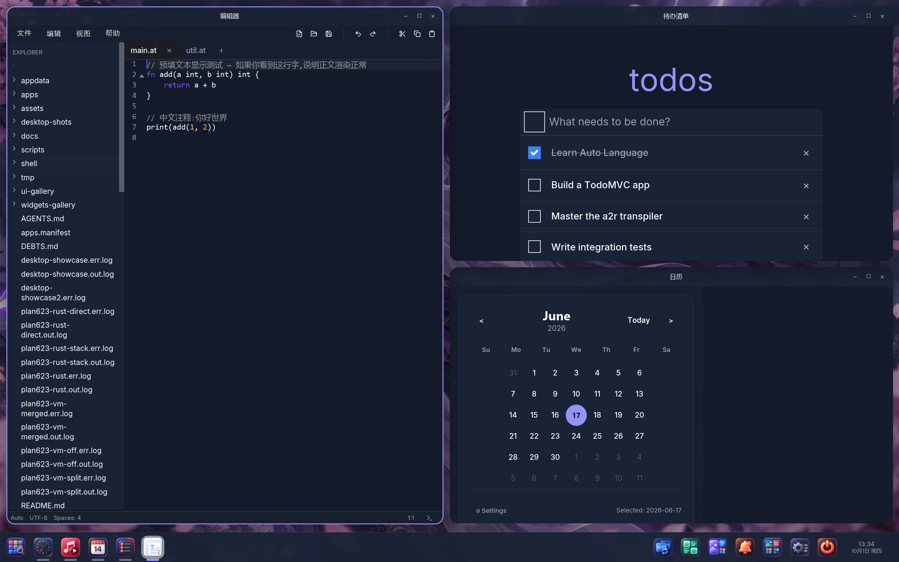
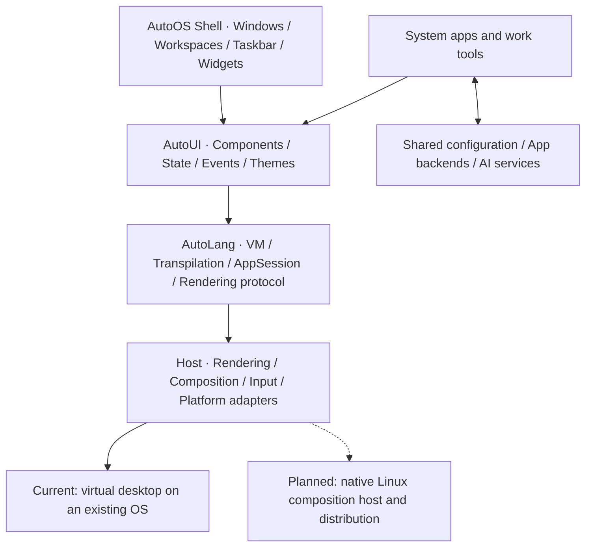

# AutoOS

**A desktop, applications, and a working environment built with Auto.**

[中文](README.md) · English

AutoOS is the desktop and system product of the
[Auto language ecosystem](https://github.com/auto-stack/auto-lang). It brings window
management, applications, configuration, terminals, and AI work tools into one
environment. Its longer-term direction is **AI + Lang + OS**: connecting knowledge,
tasks, and tools in a working environment people can understand and control.

The current primary form is **OS over OS**: a virtual desktop running alongside the
host desktop, using the existing operating system's kernel, drivers, and services.
The next stage will pursue an independent Linux distribution using the same desktop
and application architecture. The complete distribution remains a roadmap goal.


*Actual virtual desktop capture, 2026-10-01. App content shows its demonstration state; [image sources](docs/images/readme/SOURCES.md).*

## Virtual desktop

AutoOS hosts multiple application windows inside one host window, with a shared
desktop experience:

- **Windows and workspaces**: focus, dragging, resizing, minimizing, workspace
  switching, and multiple-window layouts.
- **Launch and switching**: desktop icons, an application launcher, a taskbar, and
  quick access to applications.
- **Desktop surfaces**: light and dark themes, wallpapers, notifications, and
  desktop settings.
- **Resident widgets**: applications expose interactive `view mini` views that
  share state with their main windows. The desktop can create sessions for supported
  apps and promote those sessions into full windows.





AutoUI describes the desktop and application interfaces, with Vue/Web and
iced/Desktop execution paths. Consistency targets layout, interaction, and themes;
application integration, platform capabilities, and text rendering can still differ.

## Architecture

**The desktop shell owns window semantics; the host owns rendering and composition.**
The window manager is itself a privileged AutoUI application (**WM-as-App**).
Window chrome, the taskbar, launcher, and other desktop surfaces are written in Auto.
The host handles input, rendering, sessions, and platform integration, allowing the
desktop experience to be reused as hosts evolve.



| Layer | Responsibilities and ownership |
|---|---|
| Product and desktop | This repository's `shell/`, desktop apps, galleries, integration manifest, and product documentation |
| Language and framework | The compiler, AutoVM, AutoUI, code generation, sessions, and rendering/composition infrastructure in `auto-lang` |
| Applications and services | Independent projects and local apps; shared settings, terminal engines, AI services, or app-specific backends as needed |
| Platform adapters | Host window systems, processes, files, and devices today; a native Linux host in the next stage |

**Execution and presentation are separate layers.** AutoVM supports interpreted
execution and development iteration; a2r provides the Auto → Rust native compilation
path. Depending on integration, apps can embed their UI subtree or connect to a
composition host through RenderQueue and desktop endpoints. All 10 entries in the
current [apps.manifest](apps.manifest) declare `launch: vm`. Native generation and
cross-process protocols have foundations, but this does not mean every app has
completed native desktop integration.

**Applications are assembled through declarations.** `apps.manifest` is the umbrella
application manifest; the desktop also discovers apps with `pac.at` under `apps/`.
Independent repositories usually connect through sibling checkouts and may also be
carried as submodules, such as `apps/kanban`. Entries are deduplicated by id, with a
container checkout taking precedence. Display names come from each app's `pac.at`
(`title` / `title_zh`). Apps with separate backends can declare daemon dependencies;
the desktop checks health before launch, starts configured backends, and supplies
their connection addresses.

See [desktop migration and ownership](docs/design/01-stage-b-desktop-migration.md),
[virtual desktop architecture](https://github.com/auto-stack/auto-lang/blob/master/docs/design/autoui/virtual-desktop.md),
and [current app launch contracts](docs/specs/shell/desktop-app-launch.md).

## Apps

The desktop combines system tools with independent work applications. This table
matches the current `apps.manifest`; each project's documentation and verification
results describe its actual features and maturity.

| Application | Purpose | Source |
|---|---|---|
| Kanban (`kanban`) | General boards, plans, and task views | [auto-kanban](https://github.com/auto-stack/auto-kanban); submodule `apps/kanban/` |
| AutoMusk (`auto-musk`) | Coding Agent and development/planning workspace | [auto-musk](https://github.com/auto-stack/auto-musk) |
| Jade Garden (`jade-garden`) | Knowledge base, notes, and knowledge work | [auto-down](https://github.com/auto-stack/auto-down), `jade-garden/front/auto/` |
| AutoTerm (`auto-term`) | Desktop terminal with an in-process terminal engine | [auto-term](https://github.com/auto-stack/auto-term), `app/` |
| JadeEdit (`jade-edit`) | AutoDown document editor | [jade-edit](https://github.com/auto-stack/jade-edit) |
| Launcher (`028-launcher`) | Desktop application entry point | [apps/028-launcher](apps/028-launcher) |
| System Log (`039-syslog`) | Desktop host system log viewer | [apps/039-syslog](apps/039-syslog) |
| Tetris (`036-tetris`) | Falling-block game | [apps/036-tetris](apps/036-tetris) |
| Klondike (`037-klondike`) | Classic solitaire | [apps/037-klondike](apps/037-klondike) |
| Minesweeper (`038-minesweeper`) | Minesweeper game | [apps/038-minesweeper](apps/038-minesweeper) |

The desktop also includes the container-discovered
[System Monitor](apps/025-sys-monitor), [UI Gallery](ui-gallery), and
[Widgets Gallery](widgets-gallery). The launch scripts connect the
[Settings Center, auto-os-config](https://github.com/auto-stack/auto-os-config),
which organizes shared configuration for applications, roles, skills, and models.
[AutoShell](https://github.com/auto-stack/auto-shell) provides structured commands and
Auto scripting as part of the related tool ecosystem. It has a distinct role from
the desktop shell and AutoTerm.

File management, Todo, Calendar, media, and other gallery examples also serve as app
incubation and framework validation material. Appearing in the desktop or a screenshot
does not by itself make an example a fully delivered system application.

## Next stage: a Linux distribution

A major direction for the next version is to move from a hosted virtual desktop to
**a native Linux desktop and independent distribution**. Linux would provide the
kernel, drivers, and essential services; AutoOS would provide the desktop shell,
applications, and working environment. This continues **Language as OS (LaOS)**:
organizing system components with Auto while adapting the runtime to different platforms.

**Smithay composition host Stage 1** provides an early foundation: a nested composition
loop, texture presentation, and the desktop's first frame have been verified.
This demonstrates a path for the host boundary to evolve toward Linux. A complete
Linux desktop session and distribution still require further work.

| Workstream | Work to pursue in the next stage |
|---|---|
| Native desktop session | Reuse the desktop shell in the Linux composition host and complete window, input, and display integration |
| Applications and compatibility | Improve native AutoUI app integration and advance window/input integration for Wayland/X11 clients |
| System and services | Define Linux deployment and lifecycles for startup, settings, terminals, AI services, and app backends |
| Distribution and maintenance | Choose the base system, dependencies, and packaging; work toward reproducible images, installation, and upgrades |
| Everyday use | Improve desktop interaction, app stability, and Web/desktop consistency through real usage scenarios |

This is a product roadmap whose scope still needs detailed designs and plans. The
base distribution, complete image, and release date have not been determined.
COSMIC informed early ecosystem exploration; the current native host route uses
Smithay. OpenHarmony integration and an AutoOS kernel are longer-term directions.

See [current Linux host progress](https://github.com/auto-stack/auto-lang/blob/master/docs/specs/auto-cosmic/project.md)
and [AutoOS history and outlook](https://github.com/auto-stack/auto-lang/blob/master/website/articles/autoos-history.md).

## Development and launch

This is the product integration repository. The language toolchain and desktop host
come from `auto-lang`. Place both repositories under one parent directory, or set
`AUTO_LANG_ROOT` to the framework checkout. Prepare the Auto CLI, the selected path's
build dependencies, and the required app repositories. Backends, media, and terminal
features also need their respective projects' runtime dependencies.

Windows PowerShell, from this repository's root:

```powershell
# Native virtual desktop (iced / VM)
./scripts/desktop.ps1 -Track iced

# Web virtual desktop (Vue, the script's default path)
./scripts/desktop.ps1 -Track vue

# Inspect dependency paths and launch commands only
./scripts/desktop.ps1 -Track iced -DryRun
```

Bash entry points:

```bash
bash scripts/desktop.sh iced
bash scripts/desktop.sh vue
bash scripts/desktop.sh iced --dry-run
```

These are development launch scripts. The Bash entry point does not imply a delivered
Linux distribution. `auto-lang` is resolved in this order: `AUTO_LANG_ROOT` → sibling
`../auto-lang` → `D:/autostack/auto-lang`. No junctions or symlinks are used. To check
out the local Kanban submodule, run `git submodule update --init apps/kanban` in the
main checkout.

## Repository and documentation

```text
auto-os/
├── shell/               # AutoUI desktop surfaces and window management UI
├── apps/                # Local desktop apps and application submodules
├── apps.manifest        # Umbrella apps and launch/backend declarations
├── assets/              # Light/dark icons and other desktop assets
├── ui-gallery/          # UI examples and application incubation gallery
├── widgets-gallery/     # Component documentation gallery
├── scripts/             # Desktop launch and engineering tools
└── docs/                # Designs, module specs, plans, and screenshots
```

- [Design index](docs/design/00-intro.md) · [Module specs](docs/specs) · [Desktop program ledger](docs/plans/autos-desktop-program.md)
- [Desktop widgets and windows](docs/specs/shell/dashboard.md) · [Desktop icons](docs/specs/shell/showdesk-icons.md) · [Wallpapers](docs/specs/shell/showdesk-wallpaper.md)
- [Icon generation tool](scripts/slice_icons.py): regenerate slices after changing source images; `python scripts/slice_icons.py --verify` checks assets
- [Contributor guidelines](AGENTS.md): auto-plan workflow, cross-repository resolution, and worktree safety
- [Auto Lang website introduction source](https://github.com/auto-stack/auto-lang/tree/master/website/autoos) · [Auto Lang v0.5 notes and outlook](https://github.com/auto-stack/auto-lang/blob/master/website/docs/releases/v0.5.md)
