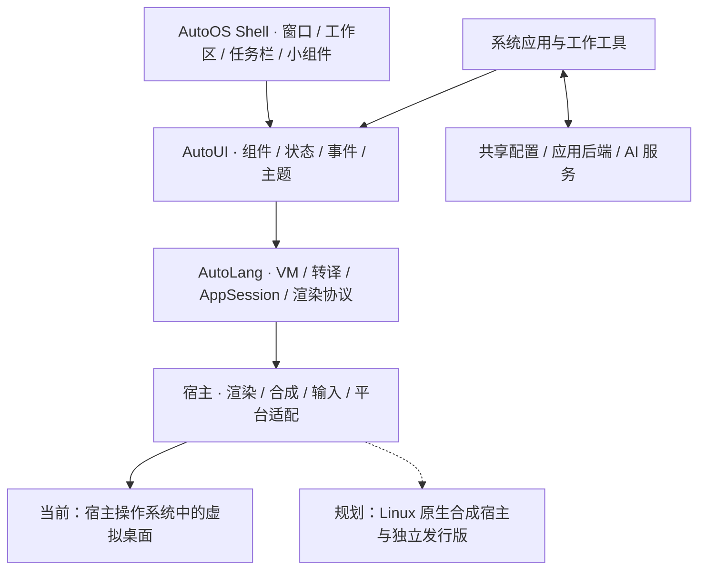

# AutoOS

**用 Auto 构建桌面、应用与工作环境。**

中文 · [English](README.en.md)

AutoOS 是 [Auto](https://github.com/auto-stack/auto-lang) 语言生态的桌面与系统产品。
它把窗口管理、应用、配置、终端和 AI 工作工具组织在同一个环境中，逐步走向
**AI + Lang + OS**：让知识、任务与工具形成连贯、可理解、可掌控的工作体验。

当前主要形态是 **OS over OS**：在已有操作系统中运行一个虚拟桌面，与宿主桌面
并行，复用宿主的内核、驱动和系统服务。下一阶段将推进基于 Linux 的独立发行版，
复用同一套桌面与应用架构。完整发行版仍在规划中。


*真实虚拟桌面截图，2026-10-01。截图中的应用内容为演示状态；[截图来源](docs/images/readme/SOURCES.md)。*

## 虚拟桌面

AutoOS 在一个宿主窗口中容纳多个应用窗口，提供统一的桌面体验：

- **窗口与工作区**：聚焦、拖拽、缩放、最小化、切换工作区，以及多窗口布局。
- **启动与切换**：桌面图标、应用启动器、任务栏与快捷入口。
- **桌面表面**：深浅主题、壁纸、通知中心和桌面设置。
- **常驻小组件**：应用通过 `view mini` 提供可交互的小视图，与主窗口共享状态；
  桌面可为支持的应用孵化会话，再升格为完整窗口。


桌面与应用界面由 AutoUI 描述，提供 Vue/Web 和 iced/Desktop 运行路径。
一致性以布局、交互和主题为目标；各应用的接入范围、平台能力与文本渲染仍有差异。

## 架构

**桌面 Shell 负责窗口语义，宿主负责渲染与合成。** 窗口管理器本身是一个
AutoUI 特权应用（**WM-as-App**），窗口边框、任务栏、启动器等桌面表面用 Auto
编写。宿主处理输入、渲染、会话与平台接入，使桌面体验可以随宿主演进而复用。



| 层次 | 职责与归属 |
|---|---|
| 产品与桌面 | 本仓 `shell/`、桌面应用、画廊、应用集成清单和产品文档 |
| 语言与框架 | `auto-lang` 的编译器、AutoVM、AutoUI、代码生成、会话和渲染/合成基础设施 |
| 应用与服务 | 独立项目及本仓应用；按需使用共享配置、终端引擎、AI 服务或自己的后端 |
| 平台适配 | 当前复用宿主的窗口系统、进程、文件与设备能力；Linux 原生宿主是后续方向 |

**执行方式与显示方式分层。** AutoVM 支撑解释运行与开发迭代，a2r 支撑 Auto →
Rust 的原生编译路径。应用可按接入方式以子树嵌入或通过 RenderQueue/桌面端点
连接合成宿主。当前 [apps.manifest](apps.manifest) 的 10 个条目均声明
`launch: vm`；原生生成与跨进程协议已有基础，但不能据此认定所有应用都已完成原生集成。

**应用按清单组装。** `apps.manifest` 是伞形应用清单，桌面还会发现 `apps/` 中
带 `pac.at` 的应用。独立仓通常以兄弟检出接入，也可由 submodule 承载（如
`apps/kanban`）；相同 id 去重，容器中的检出优先。展示名来自应用的
`pac.at`（`title` / `title_zh`）。有独立后端的应用可声明 daemon 依赖，桌面
在启动前探测健康状态，并按配置拉起后端、注入连接地址。

详见 [桌面迁移与职责边界](docs/design/01-stage-b-desktop-migration.md)、
[虚拟桌面架构](https://github.com/auto-stack/auto-lang/blob/master/docs/design/autoui/virtual-desktop.md)
与 [当前应用启动约定](docs/specs/shell/desktop-app-launch.md)。

## Apps

桌面既包含系统工具，也接入独立的工作应用。下表对应当前 `apps.manifest`；
具体功能与成熟度以各项目说明和验证结果为准。

| 应用 | 用途 | 源码 |
|---|---|---|
| Kanban（`kanban`） | 通用看板、计划与任务视图 | [auto-kanban](https://github.com/auto-stack/auto-kanban)；submodule `apps/kanban/` |
| AutoMusk（`auto-musk`） | Coding Agent、开发与计划工作台 | [auto-musk](https://github.com/auto-stack/auto-musk) |
| Jade Garden（`jade-garden`） | 知识库、笔记与知识工作 | [auto-down](https://github.com/auto-stack/auto-down)，`jade-garden/front/auto/` |
| AutoTerm（`auto-term`） | 桌面终端，接入进程内终端引擎 | [auto-term](https://github.com/auto-stack/auto-term)，`app/` |
| JadeEdit（`jade-edit`） | AutoDown 文档编辑器 | [jade-edit](https://github.com/auto-stack/jade-edit) |
| Launcher（`028-launcher`） | 桌面应用启动入口 | [apps/028-launcher](apps/028-launcher) |
| System Log（`039-syslog`） | 查看桌面宿主的系统日志 | [apps/039-syslog](apps/039-syslog) |
| Tetris（`036-tetris`） | 俄罗斯方块 | [apps/036-tetris](apps/036-tetris) |
| Klondike（`037-klondike`） | 经典纸牌接龙 | [apps/037-klondike](apps/037-klondike) |
| Minesweeper（`038-minesweeper`） | 扫雷 | [apps/038-minesweeper](apps/038-minesweeper) |

桌面还包括容器发现的 [系统监视器](apps/025-sys-monitor)、
[UI 画廊](ui-gallery) 与 [组件画廊](widgets-gallery)，并通过启动入口接入
[设置中心 auto-os-config](https://github.com/auto-stack/auto-os-config)。
设置中心组织应用、角色、技能与模型等共享配置。
[AutoShell](https://github.com/auto-stack/auto-shell) 提供结构化命令与 Auto 脚本能力，
属于相关工具生态，与桌面 Shell、AutoTerm 各有职责。

画廊中的文件管理、待办、日历、媒体等示例也是应用孵化与框架验证的载体；
示例出现在桌面或截图中，不等于已成为完整交付的系统应用。

## 下一阶段：Linux 发行版

下一版的重要方向是把 AutoOS 从宿主中的虚拟桌面推进为 **Linux 上的原生桌面与
独立发行版**：复用 Linux 内核、驱动和必要系统服务，由 AutoOS 提供桌面外壳、
应用与工作环境。这承接 **Language as OS（LaOS）** 的理念——用 Auto 组织系统
部件，让运行环境适配不同平台。

已有起点是 **Smithay 合成宿主 Stage 1**：嵌套合成循环、纹理呈现和桌面首帧已
完成早期验证。它证明宿主接缝可以继续向 Linux 演进，完整 Linux 桌面会话与
发行版仍需后续建设。

| 工作方向 | 下一阶段需要推进的内容 |
|---|---|
| 原生桌面会话 | 在 Linux 合成宿主复用桌面 Shell，完善窗口、输入和显示接入 |
| 应用与生态兼容 | 完善 AutoUI 原生应用接入，推进 Wayland/X11 客户端的窗口与输入集成 |
| 系统与服务集成 | 梳理启动、配置、终端、AI 服务和应用后端的 Linux 部署与生命周期 |
| 发行与维护 | 确定基础系统、依赖与打包方式，逐步形成可复现镜像、安装与升级流程 |
| 使用质量 | 继续完善桌面交互、应用稳定性和 Web/桌面一致性，验证实际使用场景 |

这是产品路线，具体范围仍需分解为设计和计划；基础发行版、完整镜像与发布日期
尚未确定。COSMIC 是早期生态参考与探索背景，当前原生宿主路线采用 Smithay。
OpenHarmony 集成与自有内核属于更长期方向。

参考 [Linux 宿主当前进展](https://github.com/auto-stack/auto-lang/blob/master/docs/specs/auto-cosmic/project.md)
与 [AutoOS 历史和展望](https://github.com/auto-stack/auto-lang/blob/master/website/zh/articles/autoos-history.md)。

## 开发与启动

本仓是产品集成仓，语言工具链和桌面宿主来自 `auto-lang`。开发时将两仓放在
同一父目录，也可用 `AUTO_LANG_ROOT` 指定框架检出。准备 Auto CLI、对应轨道的
构建依赖和所需应用仓；后端、媒体与终端等能力还需各项目的运行依赖。

Windows PowerShell（在本仓根目录）：

```powershell
# 原生虚拟桌面（iced / VM）
./scripts/desktop.ps1 -Track iced

# Web 虚拟桌面（Vue，脚本默认轨道）
./scripts/desktop.ps1 -Track vue

# 只检查依赖路径与启动命令
./scripts/desktop.ps1 -Track iced -DryRun
```

Bash 入口：

```bash
bash scripts/desktop.sh iced
bash scripts/desktop.sh vue
bash scripts/desktop.sh iced --dry-run
```

这些是开发启动入口，Bash 脚本的存在不代表 Linux 发行版已经交付。
`auto-lang` 定位顺序为 `AUTO_LANG_ROOT` → 兄弟目录 `../auto-lang` →
`D:/autostack/auto-lang`。不使用 junction/symlink。若需要 Kanban 的本地
submodule 检出，可在主检出运行 `git submodule update --init apps/kanban`。

## 仓库与文档

```text
auto-os/
├── shell/               # AutoUI 桌面表面与窗口管理界面
├── apps/                # 本仓桌面应用与应用 submodule
├── apps.manifest        # 伞形应用与启动/后端声明
├── assets/              # 深浅主题图标及其他桌面资源
├── ui-gallery/          # UI 示例与应用孵化画廊
├── widgets-gallery/     # 组件文档画廊
├── scripts/             # 桌面启动与工程工具
└── docs/                # 设计、模块规范、计划与截图
```

- [设计索引](docs/design/00-intro.md) · [模块规范](docs/specs) · [桌面程序台账](docs/plans/autos-desktop-program.md)
- [窗口与桌面小组件](docs/specs/shell/dashboard.md) · [桌面图标](docs/specs/shell/showdesk-icons.md) · [壁纸](docs/specs/shell/showdesk-wallpaper.md)
- [图标生成工具](scripts/slice_icons.py)：修改图标源图后生成切片；`python scripts/slice_icons.py --verify` 校验资产
- [工程协作规约](AGENTS.md)：auto-plan 流程、跨仓解析与 worktree 安全规则
- [Auto Lang 网站介绍源码](https://github.com/auto-stack/auto-lang/tree/master/website/zh/autoos) · [Auto Lang v0.5 说明与后续展望](https://github.com/auto-stack/auto-lang/blob/master/website/docs/releases/v0.5.md)
